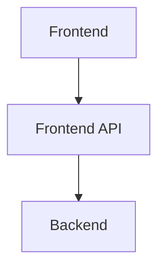

# CalculatorTest
# Table of Contents
1. [Overview](#overview)
2. [System overview](#system-overview)
3. [Commands](#commands)
    - a. [Running tests locally](#running-tests)
    - b. [Starting local server](#starting-local-server)
4. [Deployment strategy](#deployment-strategy)

## Overview
- The CalculatorTest project is designed to provide a user-friendly frontend interface for performing arithmetic operations. 
- The frontend communicates with a backend service over the internet, which processes the calculations and returns the results in JSON format.

## System Overview

## Commands
### Running Tests
- Unit: ``npm run test:unit``
- E2E: ``npm run test:e2e``
### Starting local server
- ``npm run dev``

## Deployment Strategy
